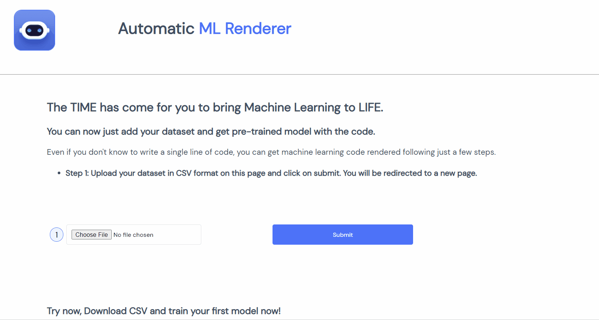
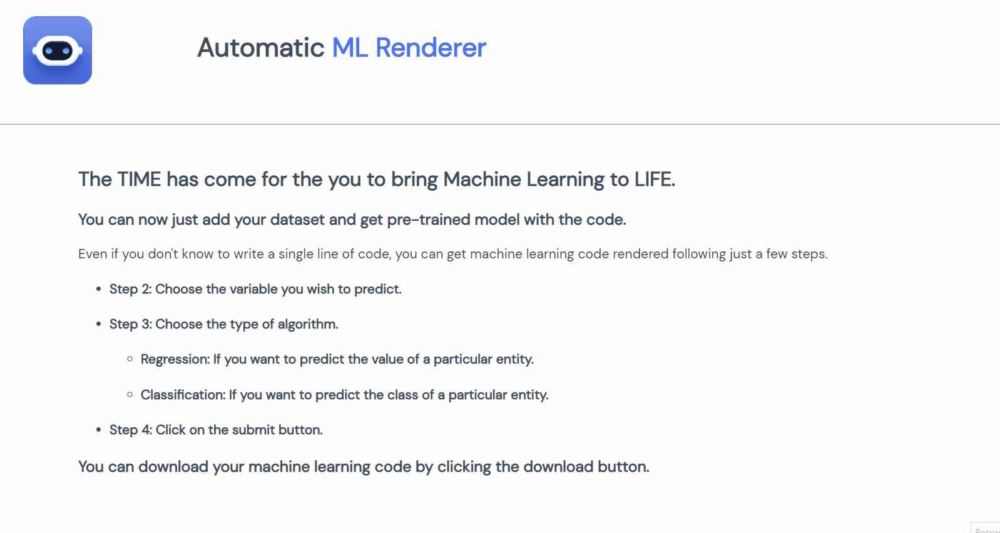
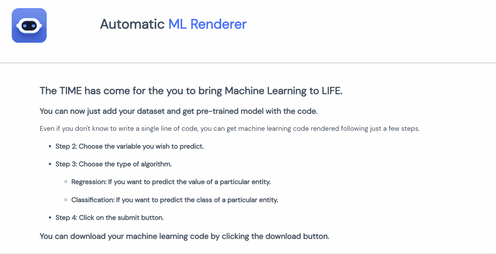
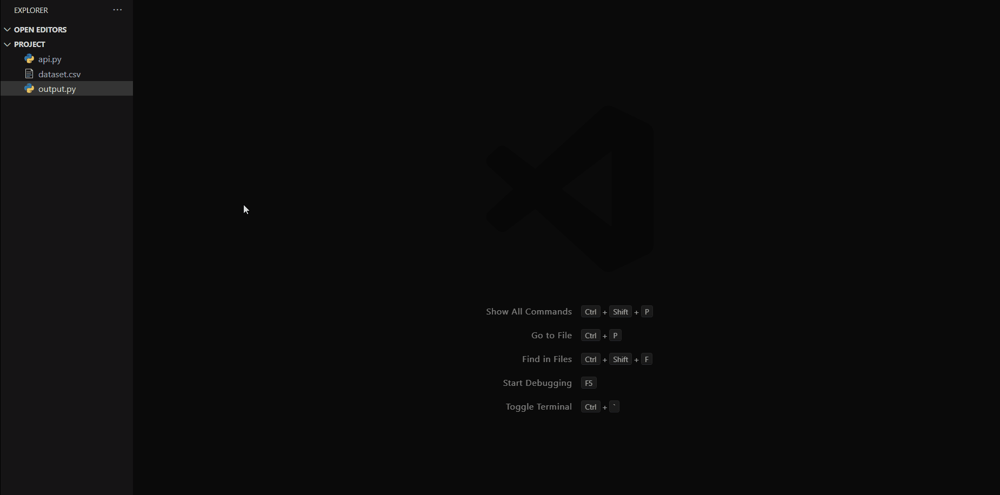

ML Assistant allows you to train a machine learning model and deploy it without writing a single line of code. It provides the output code and and the API which can can be deployed or integrated with any website.

  

## Terms to know:

  

- Dataset: Dataset is a collection of data. For Machine Learning we use a tabular dataset. The dataset contains attributes (columns) which define the features for a certain dataset.

  

- Target Variable: Target Variable is the the feature of the dataset which whose values you need to predict. Depending on the target variable a Machine Learning algorithm can be a Classification model or Regression model.

  

- Classification: Classification model or function is used to predict values which are discrete in nature. In classification, data is categorized under different labels according to some parameters given in input and then the labels are predicted for the data. For example: Predicting which class of flowers a particular flower belongs to, yes/no or true/false questions like if a patient is diabetic or not etc.

  

- Regression: Regression model or function is used to predict continuous real values. The target outcome for regression model will always be a quantity. For example: Price of house, temperature of a city over certain period of time etc.

  

- Categorical Data: Categorical Data includes the text columns. In Python these columns have the type 'Object' and must be encoded to some numerical value for the algorithm to work.

## Requirments and Installations

  

 -  [Latest version of python](https://www.python.org/downloads/)

 - Following python libraries are required for the model and api to run.

		 - pandas
		 - numpy
		 - scikit-learn
		 - flask
		 
 - ⭐ All the requirements will be installed automatically when the app is run on your machine.
 - Incase, requirements do not get installed automatically, the following commands can be used to install the libraries manually.

  

```bash

pip install pandas

pip install numpy

pip install scikit-learn

pip install Flask==1.1.2

```

## How to use

  
**Step 1: Upload CSV**
- Upload the dataset (in CSV format) and click on submit. 
>⚠️**Make sure the file is in CSV format.**



**Step 2:  Select Target**
- You will be presented with a list of features ( columns of your dataset). Select the feature which you need to predict.

**Step 3:  Select Type of Model**
  

- From the dataset identify and select the type of model you want, that is Regression or Classification (which are described above) and click on submit.

  

- Depending on the accuracy the model with the best accuracy will be returned.

  

- For Regression it will return one out of these models:

  

-  [Linear Regression](https://scikit-learn.org/stable/modules/generated/sklearn.linear_model.LinearRegression.html)

-  [Support Vector Machine (SVM)](https://scikit-learn.org/stable/modules/generated/sklearn.svm.SVR.html)

-  [Decision Tree](https://scikit-learn.org/stable/modules/generated/sklearn.tree.DecisionTreeRegressor.html)

- To measure the accuracy [r2_score](https://scikit-learn.org/stable/modules/generated/sklearn.metrics.r2_score.html) metric has been used

  

- For Classification it will return one out of these models:

-  [Logistic Regression](https://scikit-learn.org/stable/modules/generated/sklearn.linear_model.LogisticRegression.html)

-  [Decision Tree](https://scikit-learn.org/stable/modules/generated/sklearn.tree.DecisionTreeClassifier.html)

-  [Random Forest](https://scikit-learn.org/stable/modules/generated/sklearn.ensemble.RandomForestClassifier.html)

- To measure the accuracy [accuracy_score](https://scikit-learn.org/stable/modules/generated/sklearn.metrics.accuracy_score.html) metric has been used



**Step 4:  Downloading Model & API Files**

- Once the model has been returned you can now proceed to download `model.py` and `api.py`. 
>⚠️Make sure to keep `model.py` and `api.py` in the same folder.



- Run `model.py` Certain files will be downloaded in the same folder as follows:

-  `model.pkl`

-  `scaler.pkl`

-  `x_encoder.pkl` (If there are attributes with categorical values. If there are are more than one multiple files will be downloaded)

-  `y_encoder.pkl` (If the target variable has categorical data)



  

>⚠️ Do not delete these files. It is important that these files are present in the same folder.

  **Step 5:  Run Flask server & API**
-  Run `model.py` to install requirements and train the model on your machine by entering the following command in your terminal

```bash
python model.py
```

> ⚠️Incase of an error refer [Requirements and Installations](#Requirements%20and%20Installations)

- -  Run `api.py` to start a flask server on your machine by entering the following command in your terminal. A sample JSON `data.json` will also be created.

```bash
python api.py
```
- A flask server will be started in your local host machine

  **Step 6:  Testing API**
 - You can test API on the `http://127.0.0.1:5000/predict_api` route `POST` request